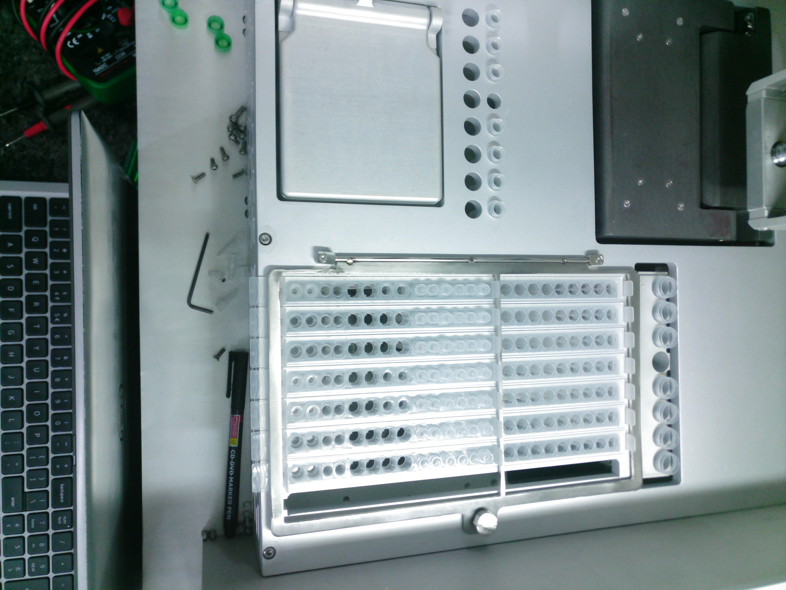
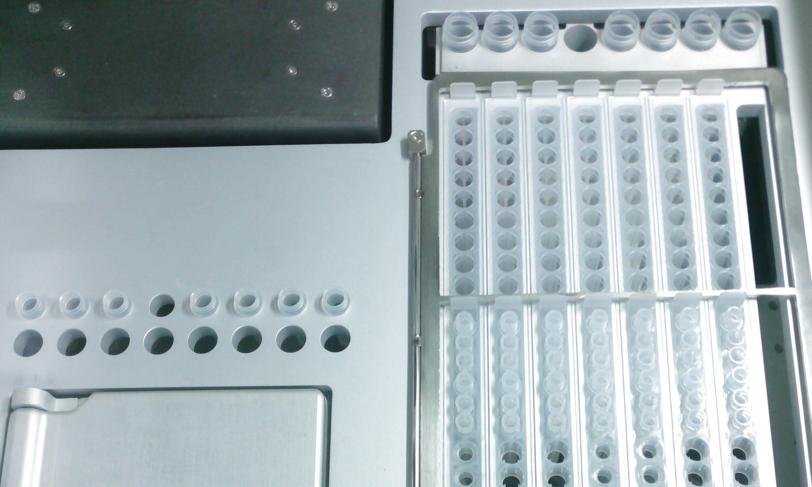
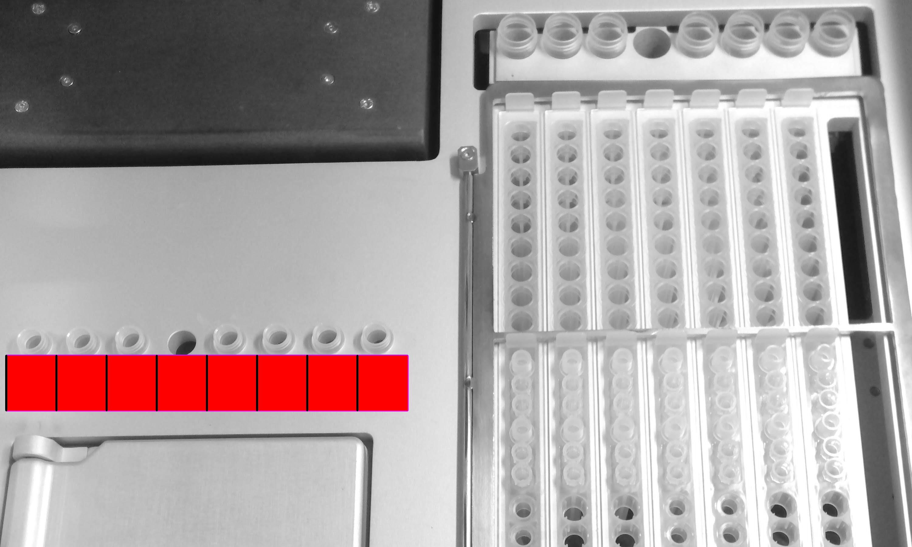
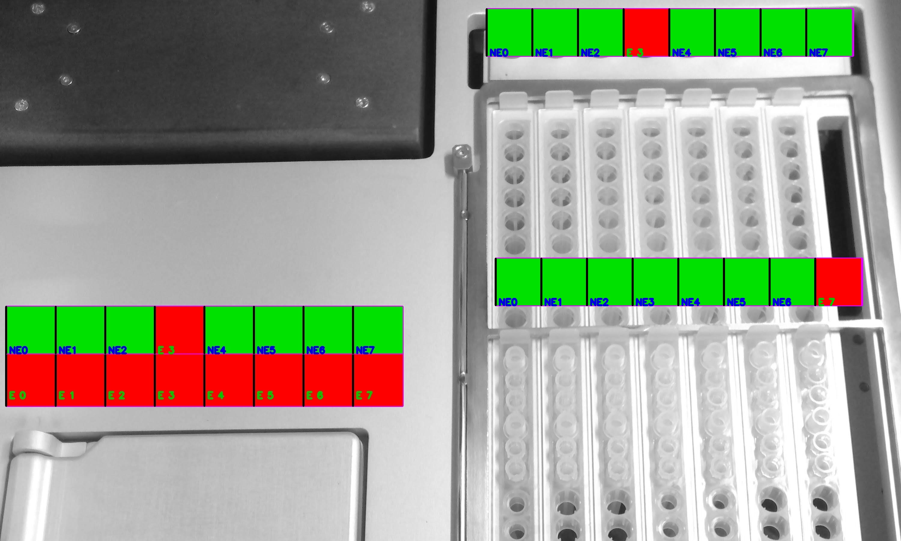

# Image Processing Scripts

## Crop and Rotate Images

This script processes images by cropping and rotating them.

### What the Script Does

1. **Read Images**: It reads all images with `.jpg`, `.jpeg`, or `.png` extensions from the specified input directory (`input_folder`).
2. **Rotate Images**: Each image is rotated 90 degrees counterclockwise.
3. **Crop Images**: After rotation, the image is cropped using the specified coordinates (`crop_coords`).
4. **Save Processed Images**: The cropped and rotated images are saved to the specified output directory (`output_folder`).

### Usage Instructions

1. Place the images you want to process in the `4x_images` directory.
2. Adjust the `crop_coords` variable to specify the cropping area (in the format `(x1, y1, x2, y2)`).
3. Run the script, and it will process the images and save the results in the `Processed` directory.

### Before and After

#### Before



#### After



## Image Processing and Analysis

This script processes images to analyze specific regions of interest (ROI) for certain characteristics such as area and circularity. It works in two main stages: initialization and processing.

### Initialization (`init` function)

1. **Read Images**: It reads grayscale images from the specified input directory (`input_dir`).
2. **Convert to BGR**: Converts each grayscale image to BGR (3-channel) format.
3. **Save Images**: Saves the converted images to the specified combination directory (`combdir`).

### Processing (`image_process` function)

1. **Define ROIs and Thresholds**: The script processes specified ROIs using given thresholds for area and circularity.
2. **Invert and Blur Images**: Each image is inverted and blurred to prepare for thresholding.
3. **Thresholding**: Applies a binary threshold to isolate certain features within the ROI.
4. **Contour Detection**: Detects contours within the thresholded ROI to find areas of interest.
5. **Analyze Contours**: Each contour is analyzed based on area and circularity to determine if it meets the specified criteria.
6. **Mark Results**: The script marks each division within the ROI as "E" (eligible) or "NE" (not eligible) based on the analysis and visualizes the results by drawing on the images.
7. **Save Processed Images and Results**: The processed images and the analysis results are saved to the specified output directory and results file, respectively.

### Usage Instructions

1. Place the images you want to process in the `Processed` directory.
2. Define the ROIs and thresholds for each area. For example:
   - `a1 = [20, 1320, 1170, 180]`
   - `a2 = [20, 1320, 1020, 155]`
   - `a3 = [1620, 1220, 30, 155]`
   - `a4 = [1650, 1220, 860, 155]`
3. Initialize the `combdir` directory using the `init` function.
4. Run the `image_process` function for each area with the defined ROIs and thresholds.
5. The script will save the processed images in the specified output directories and the results in the specified results files.

### Before and After

#### Before


#### After




#### Final Image



### Example Usage

1. Initialize the combination directory:
    ```python
    init(input_directory, comb_img_dir)
    ```

2. Process images for each area with defined ROIs and thresholds:
    ```python
    image_process(input_directory, output_directory, results_file, comb_img_dir, a1, 7100, 0.718)
    image_process(input_directory, output_directory2, results_file2, comb_img_dir, a2, 7100, 0.718)
    image_process(input_directory, output_directory3, results_file3, comb_img_dir, a3, 7100, 0.718)
    image_process(input_directory, output_directory4, results_file4, comb_img_dir, a4, 19000, 0)
    ```
